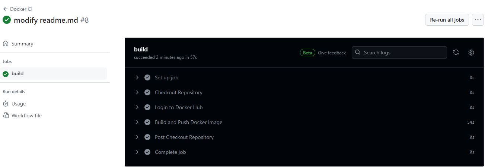

# shine-app
**Task # 1  Building a docker container via GitHub Actions**

Task: Build a container image, and push it into a registry  
Scenario: You have a simple R Shiny application. You need to build a container image, so it can
be deployed somewhere later on.  
To do:  
Create a Hello World R Shiny app application (you can use one of the [examples](https://github.com/rstudio/shiny-examples/tree/main))  
Prepare the Dockerfile, which can be used to build the container. Provide information on
how to build the image locally (with Docker/Podman) and run the container.    
Prepare CI process (GitHub Workflows/Gitlab CI), which builds the container image, and
pushes it to a registry (e.g., Docker Hub, Quay.io, GitHub Container Registry). The CI
should be run on push to the main branch and periodically on Saturday at 7 PM (push an
image with the latest tag)


Prerequisites:
1. Github account.
2. Docker hub account. 
3. Install Docker.

**Solution:** 

1. Create Dockerfile. It defining how to build Docker image.
[Dockerfile](./Dockerfile)
2. Build a container per dockerfile.  
``sudo docker build -t shiny-app . ``  

***Outputs:***  
```
terra@DESKTOP-NFU8E2P:/app/shine-app$ sudo docker build -t shiny-app .
[+] Building 7.6s (11/11) FINISHED                                                                          docker:default
 => [internal] load build definition from Dockerfile                                                                  0.1s
 => => transferring dockerfile: 465B                                                                                  0.0s 
 => [internal] load metadata for docker.io/rocker/r-ver:latest                                                        7.3s 
 => [auth] rocker/r-ver:pull token for registry-1.docker.io                                                           0.0s
 => [internal] load .dockerignore                                                                                     0.1s
 => => transferring context: 2B                                                                                       0.0s 
 => [1/5] FROM docker.io/rocker/r-ver:latest@sha256:1478c0bd3dfc26618eb032fa86ba969bd497d1752786f4b89dcc4c6f98d9f2d8  0.0s 
 => [internal] load build context                                                                                     0.0s
 => => transferring context: 1.55kB                                                                                   0.0s 
 => CACHED [2/5] WORKDIR /shiny-app                                                                                   0.0s 
 => CACHED [3/5] RUN R -e "install.packages('shiny')"                                                                 0.0s 
 => CACHED [4/5] RUN R -e "install.packages(c('dplyr', 'ggplot2', 'gapminder'))"                                      0.0s 
 => CACHED [5/5] COPY app.R /home/shiny-app/app.R                                                                     0.0s 
 => exporting to image                                                                                                0.0s 
 => => exporting layers                                                                                               0.0s 
 => => writing image sha256:be8b5852f825b4f0bb40b125002f41481ffa7799b84fceea929858bd555fe5ab                          0.0s 
 => => naming to docker.io/library/shiny-app                                                                          0.0s 
```

3. Create a container from the newly created image ("shiny-app") and run it.  
``sudo docker run -p 8080:8080 shiny-app``

***Outputs:***  
```
terra@DESKTOP-NFU8E2P:/app/shine-app$ sudo docker run -p 8080:8080 shiny-app

Listening on http://0.0.0.0:8080
```

4. (Optional). Create tag, login in your Github account, push image  
```sudo docker tag shiny-docker-app your_repo/shiny-docker-app```
5. (Optional). Push image into github.  
``` sudo docker push your_repo/shiny-docker-app:latest ```  

Next create CI via GitHub Actions.  
1. Setting up the repository in Docker Hub.
- create repo on Github
- create access token (“Account settings” - “Security” - “New Access Token”).
- Go to your Github repository “Settings” - “Secrets and variables” - “Actions” - “New repository secret”.  
Add name - ``DOCKERHUB_TOKEN``, secret - ``YOUR_SECRET_FROM_PREVIEW_STEP``
2.  Creating the GitHub Actions Workflow 
- In the root directory of your github repository, create a new directory .github/workflows  
- Inside the .github/workflows directory, create a file [build.yml](./.github/workflows/build.yml) and write code.  
3. Pushing to GitHub and testing the workflow.
You might see your result on "Action" tab in your repo.



